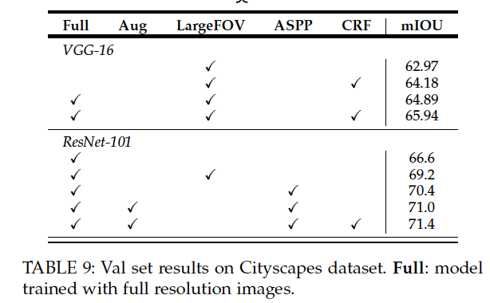

## DeepLab

Deeplabv1: [http://ethereon.github.io/netscope/#/gist/f3643b581154e8d6f26bde092e8363ad](http://ethereon.github.io/netscope/#/gist/f3643b581154e8d6f26bde092e8363ad)

Deeplabv2: [http://ethereon.github.io/netscope/#/gist/ff41a61a5384146fc099511a5075e1f9](http://ethereon.github.io/netscope/#/gist/ff41a61a5384146fc099511a5075e1f9)

Totally, PascalVOC 30K iterations, Cityscapes 45K iterations.

Pascal VOC best scale(500 times/image):

Batch Size | Scale
------------ | -------------
15| 50

Arch|batch/image_size| #params| size |speed
--| --| --| ----| ----
DenseNet(L121-k32)|15/321| 6.9M|26.65MB|2.8iter/s
DenseNet(L201-k32)|15/321| 18M|69.24MB|1.52iter/s
DenseNet(L264-k32)|7/321| 30M|117.22MB|2iter/s
resnet101|25/321|42M|163MB|1.4iter/s|

### Pascal VOC

Arch | #Params(M) |Val mIoU 
------------ | -------------| -------------
deeplabv2.voc.imagesize473|42|70.5
deeplabv2.voc.imagesize473.scratch.lr1e-1||very low
deeplabv2.voc.imagesize473.scratch.lr1e-2|| 44.1
deeplabv2.voc_train.imagesize321.scale50.scratch||epoch5:27,terminated
deeplabv2.voc.imagesize473.scratch|42|49.9
deeplabv2.voc.scale16.imagesize473.scratch|42|54.6
deeplabv2.voc.imagesize321.densenet31k48.scratch|5|48.6
deeplabv2.voc.imagesize321.densenet31k60.scratch|8|49.4
deeplabv2.voc.imagesize321.densenet121k48.scratch|15|50.6
deeplabv2.voc.imagesize321.densenet121k60.scratch|24|50.2
deeplabv2.voc.imagesize321.scratch|42|50.1

### Camvid 

Arch | #Params(M) |Test mIoU(66)
------------ | -------------| -------------
deeplabv2.camvid.imagesize473.scratch_acturally321||(val:62.5) 49
deeplabv2.camvid.imagesize473.scratch|47|(val:62.5)
deeplabv2.camvid.imagesize473.res50.scratch|23|(val:56.7)
------------ | -------------| -------------
deeplabv2.camvid.imagesize321.toy.realtest.scratch|2.9|47.1
deeplabv2.camvid.imagesize473.toy.realtest.scratch|2.9|38
deeplabv2.camvid.imagesize473.toy.resnet101.scratch|42.7|?
deeplabv2.camvid.imagesize473.toy.nocompression.realtest.scratch|5.2|44
deeplabv2.camvid.imagesize473.toy.stem.realtest.scratch|3.2|?
deeplabv2.camvid.imagesize473.toy.k60.realtest.scratch|8.2|?

### Aerial 

Arch | Val mIoU(target: 88.67)
------------ | -------------
deeplabv2.aerial.imagesize473.scratch|86.72
deeplabv2.aerial.imagesize473.res50.scratch|86.9

### Pascal in Slim
Params | Val mIoU
------------ | -------------
slim.deeplabv2.voc.imagesize473| 58.8
deeplabv3.voc.imagesize473|63.2
deeplabv3.voc.imagesize473|**71.6**
deeplabv3.voc.imagesize473.scale12|70.4
deeplabv3.voc.imagesize513.scale4.lrmultfix.noASPP.fortune|68.8
deeplabv3.voc.imagesize513.scale4.lrmultfix.fortune|71.2
deeplabv3.voc.imagesize513.scale4.lrmultfix.tune|68.9(slowly move down)
deeplabv3.voc.imagesize513.scale4.lrmultfix.tune.betagammafix|69.7(slowly move down then up)
slim.deeplabv2.dilation6.voc.imagesize473|**70.6**

### Result On Cityscapes(offical: deeplabv2 val mIoU:71.4% With Full+Aug+ASPP+CRF)

Arch | Val mIoU
------------ | -------------
deeplabv2.cs.imagesize672.scale18|**74.21** ([test:72.67](https://www.cityscapes-dataset.com/evaluation-results/?submissionID=984))

**notice:** The validation mIOU for this repo is  all achieved  with multi-scale and left-right flippling.

## Devils in version3

* image size=513; batch size=16;

* The proposed model is trained with output stride = 16, and then during inference we apply output stride = 8 to get more detailed feature map. 

* multi-GPU training;

* After training on the trainaug set with 30K iterations and initial learning rate = 0.007, we then freeze batch normalization
parameters, employ output stride = 8(via dilation to control it), and train on the official PASCAL VOC 2012 trainval set for another 30K iterations and smaller base learning rate = 0.001.

* how to evaluate

Arch | Pre | After
------------ | -------------| -------------
deeplabv3.voc.imagesize513.scale4.lrmultfix.noASPP.fortune| 68.9 |59 |

## Ideas

*  Semi Supervised Semantic Segmentation Using Generative Adversarial Network
*  Embedding human skeleton to furthur optimize human segmentation
*  [Semantic Image Synthesis via Adversarial Learning](https://github.com/dongzhuoyao/pytorchgo/tree/master/example/SISviaAL)
*  Reinforcement learning
*  embed traditional method
*  [Semantic-aware  Urban Scene Adaption](https://github.com/Peilun-Li/SG-GAN)
* setup a few-shot segmentation dataset.
* [Weakly Supervised Semantic Segmentation Based on Web Image Co-segmentation](https://ascust.github.io/WSS/)
* Instance-Level Salient Object Segmentation
* [Learning Affinity via Spatial Propagation Networks](https://arxiv.org/abs/1710.01020)
*  [A Classification Refinement Strategy for Semantic Segmentation](https://arxiv.org/abs/1801.07674)
* [Statistically Motivated Second Order Pooling](https://arxiv.org/abs/1801.07492)
* [Spatial Temporal Graph Convolutional Networks for Skeleton-Based Action
Recognition](https://arxiv.org/abs/1801.07455)
*  [LIFT](https://github.com/cvlab-epfl/tf-lift)
* use [Pose-Guided-Person-Image-Generation](https://github.com/charliememory/Pose-Guided-Person-Image-Generation) to realize human segmentation

## Target

*  slim deeplabv2 pascal reproduce
*  slim deeplabv2 Cityscapes reproduce
*  slim deeplabv2 Mapillary reproduce
* larger batch size use gradient checkpoint
